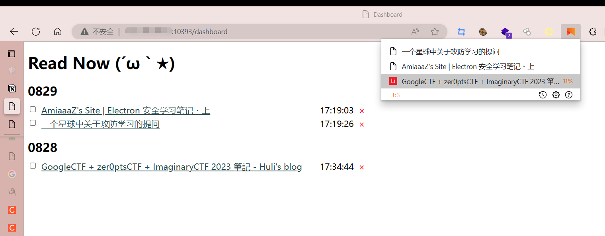

For a **complete** introduction, please check the [README.md](https://github.com/willbchang/chrome-read-later) of the original project.

## Installation

### backend_server

1. Initialize the `data.db` with following python code

```python
import sqlite3

conn = sqlite3.connect('data.db')
cursor = conn.cursor()

cursor.execute('''CREATE TABLE IF NOT EXISTS reading_list (
                    id INTEGER PRIMARY KEY AUTOINCREMENT,
                    title TEXT,
                    url TEXT UNIQUE,
                    create_time TIMESTAMP DEFAULT CURRENT_TIMESTAMP,
                    status BOOLEAN DEFAULT 0
                )''')
conn.commit()
conn.close()
```

2. Set environment variable key `seckey` with any value you want

3. Deploy the Flask app in the backend_server folder

### extension

1. Clone this repo
2. Install this repo as  an extension on Chrome or Edge manually
3. Configure the `URL`(such as `http://your-ip:port/api/`) and `seckey` in the extensions settings

## Usage

- Use it like the original chrome-read-later extension
- View all your saved pages in `http://you-ip:port/dashboard`, you can change each page's reading status and delete it
- Attention: You need to append `?seckey=xxxx` when accessing `http://you-ip:port/dashboard` for the first time. It will remember the session thereafter



## Features

- Use selectionText as page title
- Connect to the backend server written in Flask and display data on a separate dashboard page.

